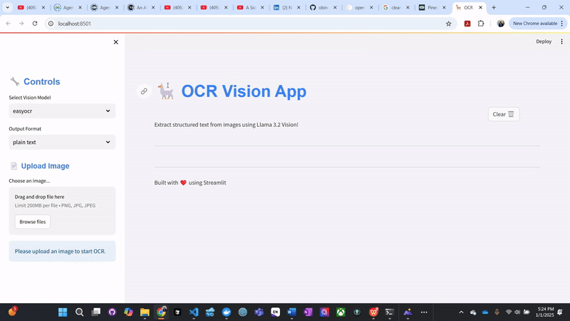

# 🦙 OCR Vision App

OCR Vision App is a user-friendly tool designed to extract structured text from images using advanced OCR models. This application supports multiple OCR models, including **EasyOCR**, **Llama3.2 Vision (local)**, and **Groq's Llama3.2 Vision** (via API). The app provides flexible output formats: plain text, Markdown, or JSON.

---

<div align="center">
  
</div>

## Features

- **OCR Model Options**: 
  - **EasyOCR**: Lightweight and quick.
  - **Llama3.2 Vision**: Advanced local model for high-accuracy OCR tasks.
  - **Groq's Llama3.2 Vision API**: State-of-the-art vision model via API integration.
  
- **Flexible Output Formats**:
  - **Plain Text**: For simple text extraction.
  - **Markdown**: For formatted content.
  - **JSON**: For structured output and metadata.

- **Dynamic Image Uploads**:
  - Supports PNG, JPG, and JPEG formats.
  - Compresses and resizes images for efficient processing.

- **Downloadable Results**: 
  - Save your extracted text in your chosen format.

---

## Prerequisites

### 1. Install Dependencies
Install the required Python libraries from `requirements.txt`:

```bash
pip install -r requirements.txt
I'll help format this README section properly in Markdown:

```markdown
## Prerequisites

### 1. Install Dependencies
Install the required Python libraries from `requirements.txt`:

```bash
pip install -r requirements.txt
```

### 2. Set Up API Key for Groq's Llama Model
To use Groq's Llama3.2 Vision model via API:

1. Create a `.streamlit` folder in your project root directory
2. Inside `.streamlit`, create a `.secrets.toml` file

Here's a sample `.secrets.toml` structure:

```toml
# .streamlit/secrets.toml
GROQ_API_KEY = "your_groq_api_key_here"
```

A template `.secrets_example.toml` is provided in the repository to guide you.

### 3. Download Llama Model Locally
To run **Llama3.2 Vision** locally:

1. Visit Llama model hub to download the required model
2. Place the downloaded model in a directory accessible to the app, e.g., `models/llama3.2`

## Getting Started

1. **Clone the Repository**
   ```bash
   git clone https://github.com/obinopaul/OCR_vision-app.git
   cd OCR_vision-app
   ```

2. **Set Up Environment**
   * Install dependencies using `requirements.txt`
   * Add your API keys to `.streamlit/secrets.toml`

3. **Run the Application**
   ```bash
   streamlit run app.py
   ```

## Usage

1. **Upload an Image**
   * Choose an image (PNG, JPG, or JPEG)
   * The app resizes the image for optimal processing

2. **Select an OCR Model**
   * EasyOCR for lightweight tasks
   * Llama3.2 Vision (local) for robust accuracy
   * Groq's Llama3.2 Vision API for cutting-edge OCR via API

3. **Choose an Output Format**
   * Plain text, Markdown, or JSON

4. **Extract Text**
   * Click the "Extract Text 🔍" button to perform OCR

5. **Download Results**
   * Save the extracted text in your preferred format

## Output Formats

* **Plain Text**
   * Simple text format
   * Filename: `extracted_text.txt`

* **Markdown**
   * Formatted content for documentation purposes
   * Filename: `extracted_text.md`

* **JSON**
   * Structured output with extracted text and metadata
   * Filename: `extracted_text.json`
